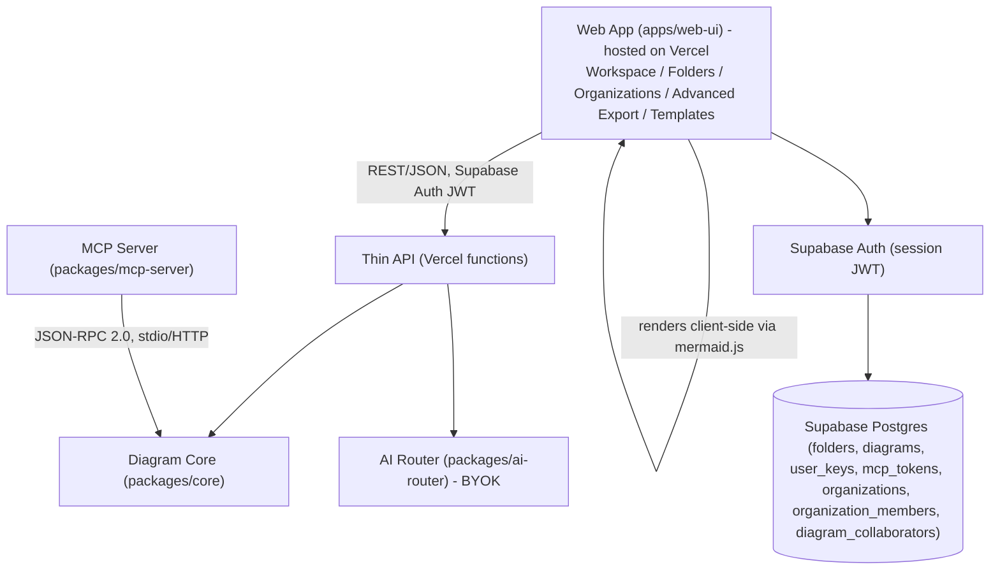
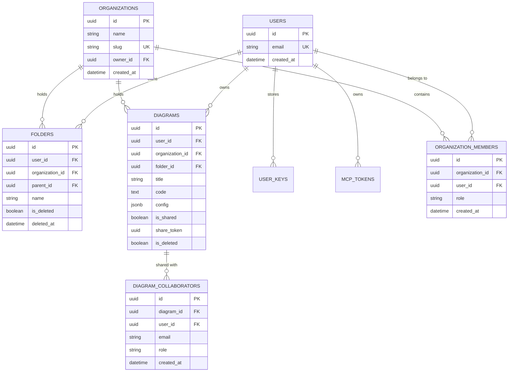

# Project Context

Durable, non-secret project facts. AI agents read this before making changes. Leave unknown fields as `<ASK_DEVELOPER>`; never guess.

Never store secrets here. Use placeholders such as `<HOSTING_RESOURCE>`, `<DATABASE_NAME>`, `<DATABASE_USER>`, and `<MCP_ALIAS>`.

---

## 1. Required Intake Status

- **Solution Cluster**: Developer Tools — Diagramming-as-Code / Live Diagram Editor (Mermaid syntax)
- **Module**: Core Platform (Home + Auth + Workspace + Settings + Folders + Organizations + MCP Server + Public API).
- **Business purpose**: Hosted, public web app for writing, previewing, organizing, sharing, and collaborating on Mermaid-syntax diagrams. Feature/UX reference: [mermaid-js/mermaid-live-editor](https://github.com/mermaid-js/mermaid-live-editor). Adds accounts, folders, team organizations, granular collaborator invites, advanced canvas backgrounds/exporting, templates library, and BYOK-only AI-assisted generation on top of the live-editor pattern. Hosted-only — no self-host mode — 100% on Vercel free tier + Supabase free tier. Open source, non-commercial, no monetization planned.
- **Primary users**: Developers/technical writers using the live editor; teams organizing diagrams in folders and sharing via links/collaborator invites; AI coding agents via MCP/API.
- **Application type**: Hosted SPA (Home, Auth, Workspace, Settings) + thin API on Vercel functions + Supabase (DB/Auth/Storage) + JSON-RPC 2.0 MCP Server (`packages/mcp-server`).

---

## 2. Tech Stack & Dependencies

- **Backend stack and version**: Node.js 24.x (Active LTS) — thin API as Vercel serverless functions calling Supabase; JSON-RPC 2.0 MCP Server (`packages/mcp-server`).
- **Frontend stack and version**: SvelteKit 2.x + Svelte 5 (runes) — currently ~2.69 / ~5.56. Matches the mermaid-live-editor reference stack.
- **Database engine and version**: Supabase (managed Postgres), 100% free tier with RLS policies across all tables.
- **Package manager / runtime versions**: pnpm with workspaces (`packages/*` + `apps/web-ui`). Node 24.x.
- **Authentication model**: Supabase Auth issues the web session JWT (email/password + magic link); `mcp_tokens` table keyed to `auth.users.id` for API/MCP auth; `organization_members` for team space tenancy.
- **Data sensitivity / PII**: Medium — Supabase Auth holds account emails/credentials; BYOK provider keys are secret-tier.

### Validation Commands

- **Build**: `pnpm --filter web-ui build` — Vercel's git-integrated build (`vite build` via SvelteKit adapter)
- **Unit Tests**: `pnpm --filter web-ui test` (Vitest)
- **E2E Tests**: Playwright
- **Linter**: ESLint (`eslint-plugin-svelte`) + Prettier (`prettier-plugin-svelte`)

### Stack & Library Decisions

- **Framework choice rationale**: Headless-core-first — `packages/core` (config schema, folder/diagram data model, validation) has no UI dependency.
- **Approved libraries**:
  - **mermaid.js** (currently 11.16.x) — diagram parsing, rendering, and export (SVG/PNG/JPEG/PDF/MMD/MD), client-side rendering.
  - **CodeMirror 6** — source editor, modular.
  - **TailwindCSS v4** — utility styling, small production CSS footprint.
  - **Zod** — schema validation.
  - `supabase-js` — PostgREST/Auth/Storage client.
- **Formatter / linter config**: ESLint + Prettier, SvelteKit defaults.
- **Lockfile policy**: `pnpm-lock.yaml` committed.
- **Data-access layer / pattern**: `supabase-js` + Postgres Row-Level Security for per-user and per-organization isolation.

---

## 3. Current Sprint Tasks

### Sprint: `Sprint 6 — Production-Grade Upgrade: Organizations, Advanced Export, Granular Sharing & Templates`

#### Module: `Full Production Suite`

##### Features:
- [x] **Organizations & Team Spaces**: Schema & RLS for `organizations`, `organization_members`, `organization_invites`, and `organization_id` on folders/diagrams. Interactive sidebar space switcher + member invite modal (`OrgSettingsModal.svelte`).
- [x] **Advanced Diagram Export System**: High-res canvas export (`AdvancedExportModal.svelte`) supporting SVG, PNG, JPEG, PDF, MMD, MD with resolution multipliers (`1x`-`8x`), custom canvas backgrounds (Dark Mesh, Pitch Black, Pure Light, Transparent, Custom Hex), and custom padding (`0px`-`128px`).
- [x] **Granular Sharing & Direct Email Collaborator Invites**: Public access controls (toggle public link, token regeneration) + direct email collaborator invitations (`ShareModal.svelte`) with `Editor` or `Viewer` roles.
- [x] **Interactive Diagram Templates Library**: Categorized template gallery (`TemplatesModal.svelte`) with real-time Mermaid preview and 1-click canvas insertion.
- [x] **Diagram Version & Edit Timeline**: Revision history table (`diagram_versions`) with author attribution (`edited_by_email`), timestamps, live Mermaid preview of historical snapshots, and 1-click version restore (`VersionHistoryModal.svelte`).
- [x] **Team Comments & Annotations**: Threaded diagram comments (`diagram_comments`) with resolution status, real-time persistence, and author badges (`CommentsModal.svelte`).
- [x] **Custom Glassmorphic Dropdowns & Icons**: Glassmorphic custom select dropdown component (`CustomSelect.svelte`) replacing all browser native HTML selects, dual-tone vector heart icon (`FavoriteIcon.svelte`), and streamlined top-right canvas toolbar.
- [x] **Global Keyboard Shortcuts & Pitch-Black Glassmorphism**: `Cmd/Ctrl+S` (manual save), `Cmd/Ctrl+E` (editor toggle), `Cmd/Ctrl+Shift+E` (export), `Cmd/Ctrl+Shift+S` (share), `Cmd/Ctrl+Shift+T` (templates). Pitch-black `#0F1117` design system across all modals.

---

### Completed Sprints

#### Sprint: `Sprint 5 — MCP Server & Public REST API (Phase 5)`
- [x] Build JSON-RPC 2.0 MCP Server (`packages/mcp-server`) for AI agent diagram operations (stdio + remote HTTP)
- [x] Implement Public REST API endpoints & `mcp_tokens` authentication table

#### Sprint: `Sprint 4 — Sharing, Trash & Polish`
- [x] Implement Diagram Share Links (`/share/[id]`) with access control and revocation
- [x] Implement Trash Bin & Restore for Folders and Diagrams

#### Sprint: `Sprint 3 — BYOK AI Router & Settings`
- [x] Build `packages/ai-router` for BYOK LLM provider abstraction (Anthropic, OpenAI, Gemini, Custom)
- [x] Implement Settings page & AES-256-GCM BYOK Vault client-side encryption
- [x] Wire BYOK AI Diagram Assistant into Workspace Toolbar with real-time streaming preview

#### Sprint: `Sprint 2 — Workspace & Folders`
- [x] Build CodeMirror 6 source editor + live client-side diagram preview (`mermaid.js`)
- [x] Create `FOLDERS` and `DIAGRAMS` database schemas & RLS policies in Supabase

#### Sprint: `Sprint 1 — Foundation`
- [x] Vercel project + Supabase project scaffold
- [x] Home page, Auth page (Supabase Auth), and Workspace shell

---

## 4. Scope & Non-Goals

- **Declared non-goals / out-of-scope for the initial build**:
  - No self-hosted / local-only / air-gapped deployment mode.
  - No managed/bundled AI provider keys — BYOK end-to-end is mandatory.
  - Not a general-purpose freeform vector canvas — Mermaid text-to-diagram first.

---

## 5. System Architecture Diagram

---

## 6. Database Schema & Entity Relationships (ERD)

---

## 7. Architectural Decision Records (ADR)

- **[ADR-001] Hosted-only, no self-hosted/local-first mode**: Runs 100% on Vercel + Supabase free tier.
- **[ADR-002] BYOK-only AI generation**: BYOK is mandatory for every AI-assisted feature.
- **[ADR-003] Fully client-side rendering & export**: Diagrams render and export (SVG/PNG/JPEG/PDF/MMD/MD) entirely in the browser via mermaid.js.
- **[ADR-004] Client-Side WebCrypto AES-256-GCM BYOK Vault**: Personal API keys are encrypted client-side using `window.crypto.subtle` before storage.
- **[ADR-005] Organization Team Spaces Multi-Tenancy**: `organizations` and `organization_members` tables with Postgres RLS policies isolated via `organization_id` on folders and diagrams.
- **[ADR-006] Pitch-Black `#0F1117` Glassmorphic Design System**: All workspace modals use `#0F1117` surface background, `border-white/15`, sleek white primary buttons (`bg-white text-black font-bold`), amber badges (`bg-amber-500/10 border-amber-500/20 text-amber-400`), and `z-[100]` overlay layer.
- **[ADR-007] Multi-Format Resolution-Scaled Export**: `AdvancedExportModal.svelte` rasterizes SVG onto HTML5 Canvas with custom background presets (`dark-mesh`, `pitch-black`, `pure-light`, `transparent`), custom padding (`0px`-`128px`), and resolution multipliers (`1x`-`8x`).
- **[ADR-008] Granular Email Collaborator Sharing**: `diagram_collaborators` table maps explicit emails/users to `diagram_id` with `editor` or `viewer` permissions alongside public link sharing.
- **[ADR-009] Svelte 5 Untracked Async `$effect` Effects**: In Svelte 5, async functions inside `$effect` that mutate `$state` variables must wrap state updates in `untrack(() => ...)` and check deduplication keys (`lastRenderedCode`, `lastFetchedDiagramId`) to prevent infinite reactive CPU loops.
- **[ADR-010] App-Wide Display Name Precedence**: User identity display across presence indicators, avatars, popover menus, and navigation pills prioritizes `user_metadata.full_name` or `display_name` over raw email addresses, with computed initials derived from full names.
- **[ADR-011] Strict 0-Diagnostic Svelte-Check Policy**: Monorepo codebase enforces a strict **0 Errors and 0 Warnings** standard across `svelte-check` compilation and type analysis. All dynamic Svelte components use Svelte 5 runes syntax (`{@const Icon = ...} <Icon />`) and modal interactive elements enforce explicit accessibility attributes (`role="presentation"`, `tabindex="-1"`, `aria-label`).

---

## 8. Gotchas & Lessons Learned

- **[Gotcha] Svelte template tag closing mismatch**: Always verify exact replacements around `{/if}` and closing `
` tags to prevent Svelte template compilation errors.
- **[Gotcha] Lucide `Image` Icon Name Collision**: Always instantiate native DOM `Image` elements via `new window.Image()` in Svelte components that import `lucide-svelte`.
- **[Gotcha] Modal z-index stacking**: CodeMirror editor elements specify high z-indexes; all modal overlays must strictly use `z-[100]` with `fixed inset-0 bg-black/80 backdrop-blur-md` to remain on top.
- **[Gotcha] Svelte 5 `$bindable` vs `$effect` CodeMirror view sync**: Check `view.state.doc.toString() !== value` to prevent infinite loops during typing.
- **[Gotcha] Svelte 5 `$effect` Reactivity Mutex**: Mutating `$state` variables inside `$effect` callbacks without `untrack` causes perpetual re-evaluation loops. Always wrap async state updates in `untrack(() => ...)` and guard with state deduplication flags.
- **[Gotcha] Supabase SSR Cookie Handling in SvelteKit**: `@supabase/ssr` `setAll` cookie setter must wrap `event.cookies.set` in `try / catch` to prevent SvelteKit from throwing `Cannot use cookies.set(...) after response generated` errors when session refresh callbacks trigger after response headers are sent.
- **[Gotcha] PostCSS `@import` Order**: In PostCSS / Vite CSS processing, external `@import url(...)` rules (e.g. Google Fonts) MUST precede all other statements (including `@import "tailwindcss";`), otherwise PostCSS compilation errors occur during server startup.
- **[Gotcha] Concurrent `mermaid.render` ID Collisions**: Parallel calls to `mermaid.render()` collide on temporary DOM element IDs inserted into `document.body`. Always debounce render queues (`queueRender`) and pre-validate syntax with `await mermaid.parse(code, { suppressErrors: true })`.
- **[Gotcha] Svelte 5 Dynamic Component Syntax**: In Svelte 5 runes mode, `<svelte:component this={...}>` is deprecated. Dynamic component types must be assigned using Svelte 5 `{@const Comp = dynamicProp}` constructs or rendered directly.