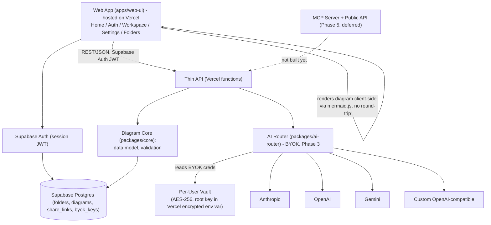
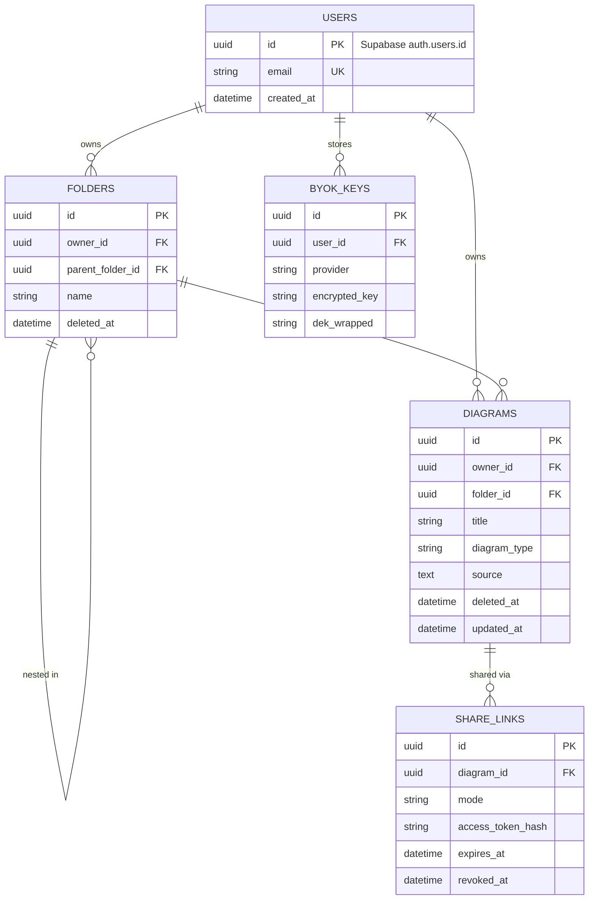

# Project Context

Durable, non-secret project facts. AI agents read this before making changes. Leave unknown fields as `<ASK_DEVELOPER>`; never guess.

Never store secrets here. Use placeholders such as `<HOSTING_RESOURCE>`, `<DATABASE_NAME>`, `<DATABASE_USER>`, and `<MCP_ALIAS>`.

---

## 1. Required Intake Status

- **Solution Cluster**: Developer Tools — Diagramming-as-Code / Live Diagram Editor (Mermaid syntax)
- **Module**: Core Platform (Home + Auth + Workspace + Settings + Folders). MCP Server + Public API are in-scope but deferred to Phase 5 (see §8).
- **Business purpose**: Hosted, public web app for writing, previewing, organizing, and sharing Mermaid-syntax diagrams. Feature/UX reference: [mermaid-js/mermaid-live-editor](https://github.com/mermaid-js/mermaid-live-editor). Adds accounts, folders, and BYOK-only AI-assisted generation on top of the live-editor pattern. Hosted-only — no self-host mode — 100% on Vercel free tier + Supabase free tier. Open source, non-commercial, no monetization planned.
- **Primary users**: Developers/technical writers using the live editor; teams organizing diagrams in folders and sharing via links. (Later) AI coding agents via MCP/API.
- **Application type**: Hosted SPA (Home, Auth, Workspace, Settings) + thin API on Vercel functions + Supabase (DB/Auth/Storage). MCP Server (stdio + remote) and public REST API ship in Phase 5.

---

## 2. Tech Stack & Dependencies

- **Backend stack and version**: Node.js 24.x (Active LTS) — thin API as Vercel serverless functions calling Supabase; no standalone backend.
- **Frontend stack and version**: SvelteKit 2.x + Svelte 5 (runes) — currently ~2.69 / ~5.56. Matches the mermaid-live-editor reference stack.
- **Database engine and version**: Supabase (managed Postgres), 100% free tier. Caps: 500MB DB, 1GB file storage, 5GB egress/mo, 50,000 MAU, 2 active projects, 500,000 Edge Function invocations/mo, auto-pause after ~7 days idle, no automatic backups. (Verify against supabase.com/pricing before launch — these shift.)
- **Package manager / runtime versions**: pnpm with workspaces (`packages/*` + `apps/web-ui`). Node 24.x.
- **Authentication model**: Supabase Auth issues the web session JWT (email/password + magic link at minimum; additional OAuth providers `<ASK_DEVELOPER>`). `mcp_tokens` table added in Phase 5, keyed to `auth.users.id`.
- **Data sensitivity / PII**: Medium — Supabase Auth holds account emails/credentials; BYOK provider keys are secret-tier.

### Validation Commands

- **Build**: `<AUTO_DETECT>` — Vercel's git-integrated build (`vite build` via the SvelteKit adapter)
- **Unit Tests**: Vitest
- **E2E Tests**: Playwright
- **Linter**: ESLint (`eslint-plugin-svelte`) + Prettier (`prettier-plugin-svelte`)

### Stack & Library Decisions

- **Framework choice rationale**: Headless-core-first — `packages/core` (config schema, folder/diagram data model, validation) has no UI dependency, so the web app and future MCP server/API consume one shared source of truth.
- **Approved libraries**:
  - **mermaid.js** (currently 11.16.x) — diagram parsing, rendering, and export (SVG/PNG via canvas), entirely client-side; no server-side headless browser needed. **Security**: sanitize any user- or AI-supplied strings before they reach mermaid's config/theming options (`themeCSS`, `fontFamily`, `altFontFamily`) — known CSS-injection/DOM-escape surface. Keep pinned to a current patched version.
  - **CodeMirror 6** — source editor, modular (load only the language/extensions in use)
  - **TailwindCSS v4** — utility styling, small production CSS footprint
  - **Zod** — schema validation (config loader, API layer, future MCP tool inputs)
  - `supabase-js` — PostgREST/Auth/Storage client
- **Banned / disallowed libraries**: `<ASK_DEVELOPER>` to confirm explicitly, but by default: no `eval`-capable or template-rendering path may touch AI- or user-supplied diagram source; no managed/bundled AI provider keys committed anywhere (BYOK only); no library requiring its own paid hosting or persistent background process; check new dependency licenses for OSS compatibility (e.g. avoid AGPL).
- **Formatter / linter config**: ESLint + Prettier, SvelteKit defaults — `<AUTO_DETECT>` exact rule set once scaffolded.
- **Lockfile policy**: `pnpm-lock.yaml` committed — `<AUTO_DETECT>` CI enforcement (e.g. `--frozen-lockfile`).
- **Data-access layer / pattern**: `supabase-js` + Postgres Row-Level Security for per-user isolation (no app-side ORM).
- **Keep-alive / free-tier ops**: GitHub Actions scheduled workflow (free on public repos) hitting `/healthz` to prevent Supabase auto-pause; UptimeRobot free tier as a second, independent pinger.

---

## 3. Current Sprint Tasks

### Sprint: `Sprint 4 — Sharing, Trash & Polish` (dates: `<ASK_DEVELOPER>`)

#### Module: `Core Platform & Sharing`

##### Feature: `Share Links & Soft Delete / Trash`

- [ ] Implement Diagram Share Links (`/share/[id]`) with access control and revocation
  - Validation commands: Vitest & Playwright
  - Success criteria: users can generate read-only / interactive share links with token hashes
- [ ] Implement Trash Bin & Restore for Folders and Diagrams
  - Validation commands: `pnpm --filter web-ui check`
  - Success criteria: soft-deleted items move to Trash and can be restored or permanently purged

---

### Completed Sprints

#### Sprint: `Sprint 3 — BYOK AI Router & Settings`
- [x] Build `packages/ai-router` for BYOK LLM provider abstraction (Anthropic, OpenAI, Gemini, Custom OpenAI-compatible) with Vitest unit tests (4/4 passed)
- [x] Implement Settings page (`/settings`) & BYOK Vault Envelope Key Encryption (AES-256-GCM client-side encryption)
- [x] Wire BYOK AI Diagram Assistant into Workspace Toolbar with real-time streaming preview and live CodeMirror 6 injection

#### Sprint: `Sprint 2 — Workspace & Folders`
- [x] Build CodeMirror 6 source editor + live client-side diagram preview (`mermaid.js` 11.4) in Workspace
- [x] Create `FOLDERS` and `DIAGRAMS` database schemas & RLS policies in Supabase
- [x] Implement folder tree sidebar navigation & diagram persistence in `apps/web-ui`

#### Sprint: `Sprint 1 — Foundation`
- [x] Stand up the Vercel project + Supabase project (100% free tier on both), wire env vars for each
- [x] Build the config schema + loader (fails boot on schema validation failure; no silent fallback for security-relevant fields)
- [x] Implement Home page, Auth page (Supabase Auth), and empty Workspace shell

---

## 4. Scope & Non-Goals

- **Declared non-goals / out-of-scope for the initial build**:
  - No self-hosted / local-only / air-gapped deployment mode — hosted-only on Vercel + Supabase free tier.
  - No managed/bundled AI provider keys — BYOK end-to-end is mandatory; no gateway proxy, no model router, no token-metering service.
  - Not a general-purpose freeform vector canvas (draw.io-style) — text/code-to-diagram, Mermaid syntax first.
- **Deferred work pushed to a later phase**: MCP Server (stdio + remote HTTP) and the Public API — required scope, built *after* Home, Auth, Workspace, Settings, and Folders are working end-to-end (see §8). AI-generation tooling built on top of MCP/API is deferred alongside it.

---

## 5. System Boundaries

- **What the system does**: parses, validates, and renders Mermaid-syntax diagrams entirely client-side (no server round-trip for preview, no headless-browser render step); offers BYOK AI-assisted diagram generation; hosted web app with Home, Auth, Workspace (editor + diagram list), Settings, Folders; supports share links.
- **What the system does NOT do**: does not hold or proxy AI provider credentials on the operator's behalf; does not execute AI-generated code (diagram-syntax text only, rendered by mermaid.js, never `eval`'d); is not a general drawing/whiteboard tool; does not run a self-hosted/air-gapped mode; does not (yet) expose MCP or a public API.
- **External integration seams**: Anthropic / OpenAI / Gemini / custom OpenAI-compatible endpoints (BYOK); Supabase (DB/Auth/Storage). MCP-speaking AI coding tools and a public REST API are future seams (Phase 5).
- **Module / layer map**:
  ```
  project/
  ├── packages/
  │   ├── core/            # diagram data model, config schema, validation — no I/O
  │   ├── ai-router/        # BYOK provider abstraction + prompt templates (Phase 3)
  │   ├── mcp-server/       # JSON-RPC 2.0 MCP server (Phase 5, deferred)
  │   └── config/           # schema, loader, env-var mapper
  └── apps/
      └── web-ui/           # Home, Auth, Workspace, Settings, Folders — deployed on Vercel
  ```
- **Allowed dependency direction**: `apps/*` → `packages/*` only; `packages/core` depends on nothing; every other package depends only on `core` + `config`.

---

## 6. System Architecture Diagram



> No server-side render worker — mermaid.js renders and exports (SVG/PNG) entirely client-side, so the whole stack fits inside Vercel + Supabase free tier with no third hosting target.

---

## 7. Database Schema & Entity Relationships (ERD)

> `USERS` represents Supabase's built-in `auth.users` table; app-specific fields live in a `profiles` row keyed to it.



> `mcp_tokens` and `render_jobs` tables are anticipated for Phase 5 but are not part of the initial schema.

---

## 8. Phased Implementation Roadmap & Active Sprint

```mermaid
gantt
    title Implementation Phase Roadmap
    dateFormat YYYY-MM-DD
    section Phase 1: Foundation
    Vercel + Supabase scaffold, config schema :p1a, 2026-08-01, 5d
    Home page + Auth page (Supabase Auth)      :p1b, after p1a, 5d
    section Phase 2: Workspace + Folders
    Editor + live client-side preview (mermaid.js) :p2a, after p1b, 10d
    Folders (create/nest/move/trash)           :p2b, after p2a, 5d
    section Phase 3: BYOK AI
    AI Router (BYOK, provider abstraction)     :p3a, after p2b, 7d
    Settings: BYOK provider keys, model assignment :p3b, after p3a, 5d
    section Phase 4: Sharing + Polish
    Share links (view/edit, expiry, revoke)    :p4a, after p3b, 7d
    Trash / soft-delete, theming, accessibility pass :p4b, after p4a, 7d
    section Phase 5: MCP + API (deferred)
    Public REST API                            :p5a, after p4b, 10d
    MCP Server (stdio first, then remote HTTP) :p5b, after p5a, 10d
```

- [x] **Phase 1: Foundation — Vercel + Supabase scaffold, config, Home + Auth pages**
- [x] **Phase 2: Workspace — live client-side editor/preview, Folders**
- [x] **Phase 3: BYOK AI Router + Settings**
- [ ] **Phase 4: Share Links, Trash, Theming**
- [ ] **Phase 5 (deferred): MCP Server + Public API**

---

## 9. UI Application Definition

### App Identity

- **App name**: `<ASK_DEVELOPER>`
- **Browser / document title-bar name**: `<ASK_DEVELOPER>`
- **Tagline**: `<ASK_DEVELOPER>`
- **Brand-assets destination path**: `<ASK_DEVELOPER>`

### Approved Design Values

- **Company name**: `<ASK_DEVELOPER>`
- **Company logos per theme**: `<ASK_DEVELOPER>`
- **Favicon per theme**: `<ASK_DEVELOPER>`
- **Design tokens / palette**: theme tokens as CSS variables; exact palette `<ASK_DEVELOPER>`
- **Fonts**: `<ASK_DEVELOPER>`
- **Density**: `<ASK_DEVELOPER>`
- **Icon style**: `<ASK_DEVELOPER>`
- **Accessibility target**: `<ASK_DEVELOPER>` — proposed baseline WCAG AA
- **Theme switcher**: `<ASK_DEVELOPER>` — proposed: System / Dark / Light, persisted per-account

### UI Stack

- **UI framework**: SvelteKit 2.x + Svelte 5, styled with TailwindCSS v4 (see §2)
- **Charting library**: N/A — diagram rendering goes through mermaid.js directly (client-side)
- **UI layout convention**: `<ASK_DEVELOPER>` — proposed baseline: split-pane (source editor left, live canvas right)

### Feature Toggles (Defaults)

- **Customizable dashboard**: `<ASK_DEVELOPER>`
- **Notifications**: `<ASK_DEVELOPER>` (default Off unless stated)
- **SSO / external IdP**: Supabase Auth handles email/password + magic link by default; additional OAuth providers `<ASK_DEVELOPER>`
- **Recycle bin (soft-delete + restore)**: On — Folders and Diagrams
- **Audit log**: Off by default, config-gated — keep off on free-tier Supabase given the 500MB DB cap

---

## 10. Navigation Tree (Config-Driven, Sidebar)

- **Public**:
  - Home `[leaf]` `Home` → / — Landing page, sign-in/sign-up entry points
  - Auth `[leaf]` `LogIn` → /auth — Sign in / sign up (Supabase Auth: email/password, magic link)
- **Workspace**:
  - Dashboard `[leaf]` `LayoutDashboard` → /dashboard — Recent diagrams, quick-create
  - My Diagrams `[accordion]` `FolderTree`
    - *(folder tree renders dynamically here)* `[leaf]` `FileText` → /diagrams/{folder_id}
  - Shared With Me `[leaf]` `Share2` → /shared — diagrams opened via a share link
  - Trash `[leaf]` `Trash2` → /trash — soft-deleted diagrams & folders
  - Editor `[leaf]` `PenSquare` → /editor/{diagram_id?} — CodeMirror source + live client-side preview
- **Settings**:
  - Profile `[leaf]` `User` → /settings/profile
  - AI Providers (BYOK) `[accordion]` `Cpu`
    - Provider Keys `[leaf]` `KeyRound` → /settings/ai-providers
    - Model Assignment `[leaf]` `SlidersHorizontal` → /settings/ai-providers/models
  - Appearance `[leaf]` `Palette` → /settings/appearance — theme switcher
  - MCP Connection `[leaf]` `Plug` → /settings/mcp — Phase 5, hidden/disabled until built
- **Administration** *(deferred until team/org features are defined, see §12)*:
  - Configuration `[accordion]` `Settings`
    - Overview `[leaf]` `SlidersHorizontal` → /admin/configuration

### Access Policies (per cluster)

| Cluster | Roles Granted |
| --- | --- |
| Public | Everyone (unauthenticated) |
| Workspace | Contributor and above — scoped to own + explicitly shared items only |
| Settings | Contributor and above — own vault only; even Admin cannot view another user's BYOK provider keys |
| Administration | Admin only (deferred — no team hierarchy defined yet) |

---

## 11. Entities

| Entity | Plural | DB Table | Screens | Owned? | State Machine |
| --- | --- | --- | --- | --- | --- |
| Diagram | Diagrams | `diagrams` | List, Detail, Create, Edit, Trash | Yes | `draft` → `saved` → (`shared`) → `trashed` → `deleted` |
| Folder | Folders | `folders` | List (tree), Create, Rename, Move, Trash | Yes | `active` → `trashed` → `deleted` |
| ShareLink | Share Links | `share_links` | Create, List, Revoke | Yes | `active` → `expired` / `revoked` |
| BYOKProviderKey | BYOK Provider Keys | `byok_keys` | List, Add, Rotate, Revoke | Yes | `active` → `revoked` |
| MCPToken *(Phase 5)* | MCP Tokens | `mcp_tokens` | View, Rotate, Revoke | Yes | `active` → `rotated` / `revoked` |

---

## 12. Roles & Tenancy

| Role | Tier | Record Scope |
| --- | --- | --- |
| Administrator | admin | ALL records except other users' BYOK vault contents (owner-only regardless of role) |
| Collaborator | team | OWN + Business Unit records *(not yet in scope — no team hierarchy defined)* |
| Contributor | self | OWN or directly assigned records only |
| Viewer | read-only | Read-only; scope per app |

- **Tenancy**: Multi-tenant hosted SaaS on Vercel + Supabase (single deployment, per-user data isolation via RLS).
- **Team / org hierarchy**: `<ASK_DEVELOPER>` — whether folders/diagrams can be shared at a team/org level (vs. personal-only, via share links) is not yet defined.

---

## 13. Security & Identity Conventions

- **Auth mechanism**: Supabase Auth for the web session (JWT). MCP bearer token (Phase 5) — separate rotate-able, hashed-at-rest token keyed to `auth.users.id`.
- **Secret manager / store**: no managed KMS on Supabase's free tier. BYOK vault's envelope-encryption root key stored as a Vercel encrypted environment variable (server-side only) — weaker than a dedicated KMS; revisit before production-scale use.
- **CI credential model**: `<ASK_DEVELOPER>`
- **Token signing scheme**: Supabase Auth issues its own session JWTs.
- **Authorization scope convention**: RBAC (Administrator/Collaborator/Contributor/Viewer) plus per-resource ownership checks, enforced via Supabase Row-Level Security where possible.
- **Password hashing algorithm**: handled by Supabase Auth.
- **Token / session lifetime policy**: Supabase session JWT lifetime `<ASK_DEVELOPER>` (confirm before launch).
- **Encryption in transit**: HTTPS only (default on both Vercel and Supabase).
- **Encryption at rest**: AES-256-GCM for the BYOK vault, envelope-encrypted under the Vercel-env-var root key; Supabase encrypts managed Postgres storage at rest by default.
- **Key rotation schedule**: BYOK keys — user-initiated, any time. Vault root key rotation: `<ASK_DEVELOPER>`
- **Field-level encryption targets**: `byok_keys.encrypted_key`, `share_links.access_token_hash`.

---

## 14. Deployment Policy

- **Deployment target**: Vercel (web app + thin API) + Supabase (Postgres, Auth, Storage) — both on free tier, no third hosting target.
- **Deployment method**: Vercel's git-integrated deploy-on-push; `<ASK_DEVELOPER>` for any Supabase migrations pipeline.
- **Source control provider**: `<ASK_DEVELOPER>`
- **Repository URL**: `<REPO_URL>`
- **CI/CD pipeline**: `<ASK_DEVELOPER>`
- **Hosting platform**: Vercel (frontend + serverless functions); Supabase (managed Postgres/Auth/Storage).
- **Runtime / build model**: `<AUTO_DETECT>`
- **Local dev support**: `<AUTO_DETECT>` — Supabase CLI local dev or `docker-compose.yml`
- **Environment URLs**:
  - `DEV`: `<URL>`
  - `QA`: `<URL>`
  - `STAGING`: `<URL>`
  - `PROD`: `<URL>`
- **Production deployment action**: AI agents must NOT deploy, migrate, or publish to production without explicit developer approval.
- **Free-tier operational notes** (verify against each platform's current docs before launch):
  - Supabase: 500MB DB, 1GB file storage, 5GB egress/mo, 50,000 MAU, 2 projects, 500,000 Edge Function invocations/mo, auto-pause after ~7 days idle, no automatic backups.
  - Vercel Hobby: ~100GB bandwidth/mo, function invocations in the hundreds-of-thousands range, single seat, one concurrent build. Function execution-time is a non-issue here since rendering/export is client-side.
  - Vercel Hobby ToS is scoped to personal/non-commercial use — fits this project as-is (open source, no monetization). Revisit only if that changes.
  - No automatic Supabase backups — plan an external backup job if diagram data matters.

---

## 15. API / Interface Conventions

> Public API and MCP are Phase 5. The web app's internal REST API exists from Phase 1.

- **Interface paradigm**: REST JSON via Vercel functions calling Supabase (Phase 1). MCP JSON-RPC 2.0 and a versioned Public REST API added in Phase 5.
- **Resource naming style**: `<ASK_DEVELOPER>` (proposed: plural nouns + HTTP verbs — `/diagrams`, `/folders`, `/share-links`)
- **Error contract format**: `<ASK_DEVELOPER>` (proposed: `{ error: { code, message, details } }`)
- **Version scheme**: `<ASK_DEVELOPER>` (proposed: URI `/api/v1`, Phase 5)
- **Pagination style**: `<ASK_DEVELOPER>` (needed for folder contents listings)
- **Standard headers**: `Authorization` (Supabase JWT; MCP bearer token added Phase 5), `Idempotency-Key` on share-link-create calls
- **API spec tool & location**: `<ASK_DEVELOPER>`
- **MCP remote transport on Vercel** *(Phase 5 note)*: long-lived Streamable HTTP/SSE connections may not survive Vercel's function-duration limits reliably — validate when Phase 5 starts; fall back to stateless per-call HTTP if needed.

---

## 16. Quality, Observability & Operability

- **Minimum test coverage bar**: `<ASK_DEVELOPER>`
- **Feature flag mechanism**: config file + mirrored env vars, set as Vercel project environment variables.
- **Structured logging format**: `<ASK_DEVELOPER>` — proposed JSON; BYOK provider request/response logs pass through a redaction filter.
- **Metrics / tracing destination**: `<ASK_DEVELOPER>` — a standalone `/metrics` scrape target doesn't fit Vercel's serverless model; point at an external sink if enabled.
- **Health / readiness endpoint**: `/healthz` (liveness), `/readyz` (readiness — checks Supabase connectivity); also the free-tier keep-alive ping target.

---

## 17. Resilience Thresholds

- **Outbound call timeouts**: per-provider AI request timeout (BYOK calls). `<ASK_DEVELOPER>` exact values.
- **Retry policy**: `max_self_correction_attempts` (default 3) for AI generation, hard wall-clock budget; ordered provider fallback chain on error/timeout.
- **Circuit-breaker thresholds**: not specified — gap. Proposed: trip after N consecutive provider errors, reset after cooldown; thresholds `<ASK_DEVELOPER>`.
- **Dead-letter / replay**: N/A for Phase 1–4 (no async job queue); revisit if Phase 5 introduces async processing.
- **Idempotency strategy**: `Idempotency-Key` header on AI-generation calls and share-link creation.
- **Free-tier-aware retention**: prune trashed diagrams/folders after a configurable purge window given the 500MB DB cap.

---

## 18. Data Lifecycle Governance

- **Data sensitivity classification**: `<ASK_DEVELOPER>` — proposed baseline: Supabase Auth data + BYOK credentials = Confidential; diagram source = Internal by default, Public once an active share link exists.
- **Retention period per class**: `<ASK_DEVELOPER>`
- **Audit log retention**: `<ASK_DEVELOPER>` (off by default)
- **Privacy regime**: `<ASK_DEVELOPER>`
- **Backup retention window**: `<ASK_DEVELOPER>` — no automatic Supabase backups; needs an external job.
- **RPO / RTO per environment**: `<ASK_DEVELOPER>`

---

## 19. Configuration Contract

- **Config example file**: `<AUTO_DETECT>` (e.g. `.env.example`)
- **Config loader**: `<AUTO_DETECT>` — custom loader with env-var mapping, set as Vercel project environment variables
- **Config precedence**: process env → config file → schema defaults
- **Required env keys** (names only, never values): `ANTHROPIC_API_KEY` *(BYOK, per-user, not stored globally)*, `SUPABASE_URL`, `SUPABASE_ANON_KEY`, `SUPABASE_SERVICE_ROLE_KEY`, a vault root-key env var (e.g. `VAULT_ROOT_KEY`)

---

## 20. Git & Review Knobs

- **Open source license**: `<ASK_DEVELOPER>` — proposed default: MIT (matches mermaid.js's own license)
- **Repository visibility**: Public
- **Commit signing policy**: `<ASK_DEVELOPER>`
- **Merge strategy**: `<ASK_DEVELOPER>`
- **Required approver count**: `<ASK_DEVELOPER>` (may be self-approved if solo-maintained at launch)
- **Branch naming convention**: `<ASK_DEVELOPER>`
- **Contribution basics**: `<ASK_DEVELOPER>` for `CONTRIBUTING.md`, issue/PR templates, `CODE_OF_CONDUCT.md`

---

## 21. Living Memory (ADRs & Gotchas)

### Architectural Decision Records (ADR)

- **[ADR-001] Hosted-only, no self-hosted/local-first mode**: Runs 100% on Vercel + Supabase free tier. No self-hosted/air-gapped deployment mode planned.
- **[ADR-002] BYOK-only AI generation**: No managed/bundled AI provider keys, no gateway proxy, no model router. BYOK is mandatory for every AI-assisted feature.
- **[ADR-003] mermaid-live-editor as feature/UX reference**: Editor + live-preview + share pattern follows mermaid-js/mermaid-live-editor — SvelteKit, CodeMirror source editor, mermaid.js for preview and export, all client-side.
- **[ADR-004] Fully client-side rendering & export**: Diagrams render and export (SVG/PNG) entirely in the browser via mermaid.js — no server-side render worker, no third hosting target needed.
- **[ADR-005] BYOK vault key management**: Envelope encryption — root key wraps a per-user DEK, which encrypts each stored provider key (AES-256-GCM). Root key lives in a Vercel encrypted env var (no managed KMS on Supabase's free tier). Even Administrators cannot view another user's decrypted vault contents.
- **[ADR-006] MCP Server + Public API are required but deferred**: Committed scope, built in Phase 5 after Home, Auth, Workspace, Settings, and Folders are stable.
- **[ADR-007] Free-tier operational risks**: Supabase auto-pauses after ~7 days idle (mitigate with a keep-alive ping against `/healthz`); no automatic backups; 500MB DB cap drives conservative trash/retention defaults.
- **[ADR-008] Stack picked to fit free-tier bandwidth/compute limits**: SvelteKit + Svelte 5, TailwindCSS v4, and modular CodeMirror 6 minimize client JS/CSS payload against Vercel's bandwidth cap and Supabase's egress cap. pnpm minimizes serverless function bundle size. Node.js 24.x (Active LTS) is the target runtime.
- **[ADR-009] mermaid.js requires ongoing sanitization discipline**: mermaid.js has a history of CSS-injection/DOM-escape issues via config-driven strings (`themeCSS`, `fontFamily`, `altFontFamily`). Diagram source comes from both users and BYOK AI generation — never pass user/AI-supplied strings into mermaid's config/theming options unsanitized. Keep mermaid patched.
- **[ADR-010] Open source, non-commercial**: Public repo, no monetization planned. Fits Vercel Hobby's personal/non-commercial ToS as-is. License, `CONTRIBUTING.md`, and issue/PR templates still open (see §20).
- **[ADR-011] Playground floating panels are mutually exclusive**: Only one floating panel (Code Editor, Canvas Actions menu, or any toolbar popover — theme/direction/layout) can be open at a time. Opening any panel auto-closes all others. Applies on both mobile and desktop. Enforced in `toggleToolbarPopover()`, the actions button click handler, and the Code Editor expand button.
- **[ADR-012] Workspace 3-pane layout & query-param routing**: Viewport-locked 3-pane studio layout (`h-screen overflow-hidden`) with collapsible left sidebar (`FolderTree`), center editor (`CodeMirrorEditor`), and right live preview. Navigation synced via URL query param `?d=<diagram_id>` to preserve expanded folder tree state.
- **[ADR-013] Pure CodeMirror 6 with Svelte 5 `$effect` bindings**: Direct instantiation of `@codemirror/view` and `@codemirror/state` inside a Svelte 5 component. Synchronizes external vs internal state changes without resetting text selection or cursor position.
- **[ADR-014] Client-Side WebCrypto AES-256-GCM BYOK Vault**: Personal API keys are envelope-encrypted client-side using `window.crypto.subtle` AES-256-GCM before storage in Supabase `user_keys`. Supabase Postgres stores only ciphertext + 4-char hints (`sk-ant-...4a9f`).
- **[ADR-015] Vite Workspace Package Import Aliases**: Web UI (`apps/web-ui/vite.config.ts`) uses `resolve.alias` pointing to `../../packages/*/src/index.ts` alongside package `"development"` and `"types"` exports for hot-reloading workspace TS modules without separate build steps.

### Gotchas & Lessons Learned

- **[Gotcha] pnpm v10 `onlyBuiltDependencies`**: In pnpm v10+, build scripts for native/binary packages (`esbuild`) must be explicitly authorized under `onlyBuiltDependencies:` and `allowBuilds:` inside `pnpm-workspace.yaml` (rather than root `package.json`).
- **[Gotcha] SvelteKit Vercel Adapter Runtime on Node 24**: On Node 24.x local runtimes, `@sveltejs/adapter-vercel` requires setting `runtime: 'nodejs22.x'` or using `@sveltejs/adapter-auto` for local build compatibility.
- **[Gotcha] SvelteKit Environment Variable Prefixing**: Client-accessible environment variables strictly require the `PUBLIC_` prefix (`PUBLIC_SUPABASE_URL`, `PUBLIC_SUPABASE_ANON_KEY`) and must be imported from `$env/static/public`. Server-only secrets (`SUPABASE_SERVICE_ROLE_KEY`, `VAULT_ROOT_KEY`) stay unprefixed and are imported from `$env/static/private`.
- **[Watch] Supabase free-project pausing**: confirm the keep-alive ping against `/healthz` actually prevents pausing once traffic is low.
- **[Watch] Client-side export fidelity**: verify mermaid.js's client-side PNG/SVG export handles large/complex diagrams acceptably across browsers.
- **[Gotcha] Playground mobile popover positioning — two patterns in use**: Toolbar popovers (theme, direction, layout) are `fixed bottom-16 mb-3` (bottom-anchored above the dock). The Canvas Actions dropdown uses `absolute right-0 mt-3` (anchored below its own trigger icon). Do NOT mix these two patterns — they look the same on desktop but behave very differently on mobile.
- **[Gotcha] Svelte block closing tag errors from partial replacements**: When replacing a block of template that ends with `{/if}` + `</div>`, leaving behind a duplicate closing chunk produces an `Unexpected block closing tag` Svelte compile error. Always verify the exact lines replaced include all closing tags.
- **[Gotcha] Mobile zoom on playground canvas**: Do NOT add zoom-in/zoom-out buttons on mobile — pinch-to-zoom is native. Keep fullscreen toggle only. Zoom buttons remain on desktop toolbar.
- **[Gotcha] Canvas Actions button vs Code Editor button height mismatch**: Actions button used `p-2.5` (square padding) while Code Editor used `px-4 py-2.5` (rectangular). Changed to `px-3.5 py-2.5` to match heights visually.
- **[Gotcha] Svelte 5 `$bindable` vs `$effect` CodeMirror view sync**: Updating CodeMirror state from external prop updates requires checking `view.state.doc.toString() !== value` to prevent infinite update loops and cursor jumps during user typing.
- **[Gotcha] SvelteKit `tsconfig.json` `moduleResolution` Overrides**: `apps/web-ui/tsconfig.json` extends `./.svelte-kit/tsconfig.json` which specifies `"moduleResolution": "bundler"`. Overriding it with `"moduleResolution": "NodeNext"` breaks `$lib` path mappings and ESM package exports (`lucide-svelte`, workspace packages). Retain default SvelteKit config.
- **[Gotcha] Lucide `Image` Icon Name Collision with `window.Image`**: Importing `Image` from `lucide-svelte` shadows the native DOM `Image` constructor used in canvas SVG rasterization. Always instantiate native image elements via `new window.Image()` in Svelte components that import `lucide-svelte`.
- **[Gotcha] Svelte 5 Form Label Association & Accessibility**: Svelte 5 typecheck requires explicit `for="id"` attributes on form `<label>` elements matching input/select `<input id="id">` controls.